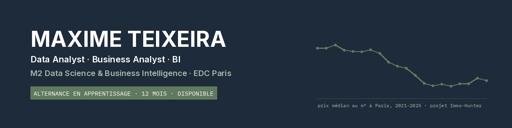

Étudiant en **M2 Data Science & Business Intelligence** à l'EDC Paris, je cherche une **alternance en apprentissage de 12 mois** en Data Analyst, Business Analyst ou BI. **Disponible dès maintenant**, rythme 3 semaines en entreprise / 1 semaine à l'école.

**Me contacter :** [LinkedIn](https://www.linkedin.com/in/mtxn)

---

## Mes projets

| Projet | Ce que ça fait | Outils | Liens |
|---|---|---|---|
| **Immo-Hunter** · projet principal | Estime le juste prix d'un logement à Paris à partir de 142 844 ventes notariales, et dit si une annonce est sous-évaluée ou surévaluée. | Python, pandas, SQL (DuckDB), scikit-learn, API Claude, Streamlit | [Code](https://github.com/maxime-txn/immo-hunter-2) · [Démo](https://immo-hunter.streamlit.app) |
| **Classification de Pokémon** | Prédit le type d'un Pokémon à partir de ses statistiques : API, nettoyage, modèle, application. | Python, pandas, scikit-learn, Streamlit | [Code](https://github.com/maxime-txn/Session-6) · [Démo](https://pokemon-ncu2sa4skbyupttzqjwbo5.streamlit.app/) |
| **Jeu du pendu** | Projet de groupe : jeu en console, niveaux de difficulté, mode deux joueurs. | Python | [Code](https://github.com/maxime-txn/Group_Project_Hangman_Game) |

## Ce que j'utilise

**Données :** Python (pandas, NumPy) · SQL (PostgreSQL, Oracle, DuckDB)  
**Modélisation :** scikit-learn  
**Restitution :** Streamlit · Plotly · matplotlib · Excel · Power BI (en cours)  
**IA :** API Claude, extraction de données structurées  
**Outils :** Git · GitHub

## En ce moment

- Je prépare la certification **Oracle Database SQL Associate (1Z0-171)**, examen en octobre 2026.
- Je fais évoluer **Immo-Hunter** : ajouter au modèle l'étage, l'état et le DPE extraits des annonces par l'IA.

## Parcours

**EDC Paris Business School** · Master Data Science & Business Intelligence (2025 – 2027)  
**Waseda University, Tokyo** · semestre d'échange (2025)
